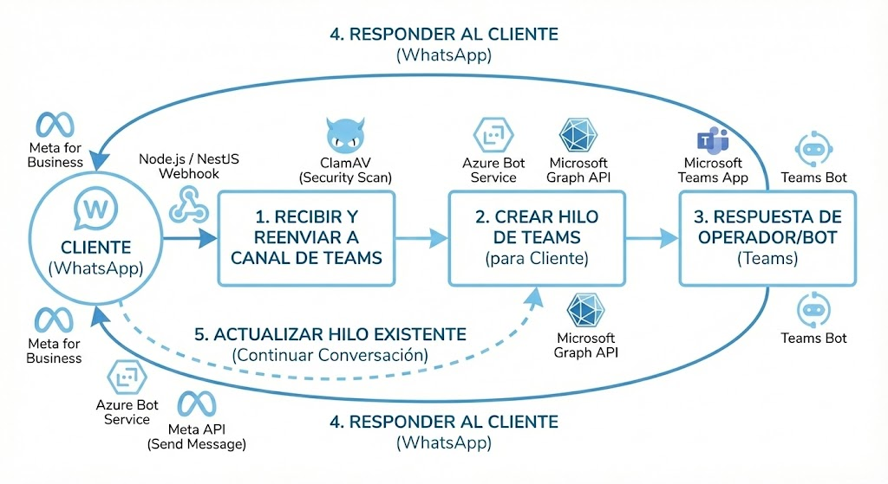

# 🤖 Omni-Channel Bot Backend – WhatsApp + Teams + NestJS

```plaintext
Sistema backend corporativo para atención omnicanal, con:

✅ Webhook de recepción bidireccional Meta API / Teams
✅ Gestión proactiva de Leads mediante integraciones web
✅ Enriquecimiento de contexto de clientes con Ubersmith
✅ Integración con Microsoft Graph, Bot Framework y Adaptive Cards
✅ Escaneo de seguridad (ClamAV) contra malware en adjuntos
✅ Persistencia de sesiones relacionales con TypeORM + MySQL/SQLite
✅ Moderación y bloqueo de números interactivo
✅ Descarga, conversión y publicación de archivos multimedia
✅ Docker y Docker Compose listos para producción
```

---

# 📑 Índice

    🔎 Descripción General

    📁 Estructura del Proyecto

    🏗 Arquitectura del Sistema

    ⚙️ Configuración del Entorno

    ☁️ Configuración en Azure y Teams

    🐳 Ejecución con Docker

    🧩 Diseño del Sistema

    💾 Modelo de Datos

    ⚠️ Reglas de Sesión y Enrutamiento

    🛡️ Seguridad (MIME & ClamAV)

    🧪 Pruebas y Verificación

    🚨 Troubleshooting

---

# 🔎 Descripción General

Este servicio actúa como un intermediario (Middleware) orquestador entre clientes finales comunicándose por WhatsApp y operadores de soporte o agentes de Microsoft Teams.

Además de reaccionar a mensajes entrantes, el sistema es proactivo: procesa clientes potenciales (Leads) provenientes de formularios externos, inicia el contacto automáticamente vía templates de Meta y prepara el espacio de trabajo en Teams para los operadores.

El sistema evalúa si el usuario ya posee una sesión activa para inyectar los mensajes en el hilo correspondiente en Teams, integrando herramientas de moderación (bloqueo/desbloqueo) y enriqueciendo el contexto del operador mediante la vinculación automática con perfiles de clientes en Ubersmith. Si existen archivos multimedia, pasan previamente por un servicio antivirus en contenedor antes de ser expuestos a la red corporativa.

---

# 📁 Estructura del Proyecto

```plaintext

Bot-Manage-Messages-Whasapp-Teams/
├── src/
│   ├── app.module.ts
│   ├── common/                 → Entidades (Conversation, Message, Media, Leads, BlockedNumber)
│   ├── config/                 → Variables y validaciones de entorno
│   ├── conversations/          → Gestión del estado (OPEN/CLOSED)
│   ├── leads/                  → Captura de formularios externos y automatización de prospectos
│   ├── media/                  → Descarga y procesamiento de archivos WA
│   ├── messages/               → Prevención de duplicidad e historial
│   ├── security/               → ClamAV y control de riesgos
│   ├── teams/                  → Integración de Graph, Bot Framework y webhooks
│   │   ├── teams-bot.handler.ts→ Escucha de respuestas en los hilos y comandos (!herramientas)
│   │   └── graph.service.ts    → Peticiones al canal, manipulación y renderizado de botones
│   ├── ubersmith/              → Integración ERP, validación de clientes y enlaces de perfil
│   └── whatsapp/               → Webhooks de Meta y llamadas Graph de WA
├── data/                       → Volumen para persistencia de base de datos
├── env.template
├── docker-compose.yml
├── dockerfile
└── package.json
```

---

# 🏗 Arquitectura del Sistema

<p align="center">
  
</p>
<p align="center">
  <em>Flujo de mensajes bidireccional entre WhatsApp y Microsoft Teams.</em>
</p>

```plaintext

A[Cliente WhatsApp] <-->|API de Meta| B[WhatsApp Controller]
B --> C[Validación de Duplicados, Sesión y Bloqueos]
C -->|Adjunto detectado| D[Media Service]
D -->|Buffer de red| E[ClamAV Container]
E -->|Limpio| F[Persistencia Base de Datos]
E -->|Infectado| X[Bloqueo FileSecurityBlockedError]
F -->|Nuevo Cliente| G[Graph Service: Crear Hilo Teams + Botones y Ubersmith]
F -->|Cliente Existente| H[Graph Service: Responder Hilo Teams]
I[Operador Teams] -->|Respuesta o Comando Bot| J[Teams Bot Handler]
J --> K[Reenvío a Meta API WhatsApp / Acción de Moderación]

L[Formulario Web] -->|Webhook / API| M[Leads Controller]
M -->|Crear Lead estado 'por contactar'| N[TypeORM / BD]
M -->|Disparar Template| O[API de Meta]
O -->|Notificación Interna| P[Teams: Hilo de espera de respuesta]
```

---

# ⚙️ Configuración del Entorno

## 1) ⚙️ Archivo .env

### 💻 Aplicación y Puerto
PORT=3000

--------------------------------------------------------
### 🟢 CREDENCIALES DEL BOT (Azure Bot Service)
--------------------------------------------------------
MICROSOFT_APP_ID=uuid_generado_en_azure_ad

MICROSOFT_APP_PASSWORD=secreto_generado_en_azure_ad

MICROSOFT_APP_TENANT_ID=uuid_del_tenant_de_microsoft

MICROSOFT_APP_TYPE=SingleTenant

--------------------------------------------------------
### 🔵 CONFIGURACIÓN DE TEAMS
--------------------------------------------------------
TEAMS_CHANNEL_ID=19:xxxxxxxx@thread.tacv2 # Canal central de recepción

TEAMS_TEAM_ID=xxxxxxxx-xxxx-xxxx-xxxx-xxxxxxxxxxxx # ID del grupo de M365

TEAMS_BOT_NAME=Nombre del bot (nombres de azure bot, teams bot y esta variable deben iguales)

--------------------------------------------------------
### 🟢 WHATSAPP API (Meta)
--------------------------------------------------------
WHATSAPP_TOKEN=token_permanente_graph_api

WHATSAPP_PHONE_ID=id_del_numero_telefonico

WHATSAPP_VERIFY_TOKEN=token_manual_para_webhook

--------------------------------------------------------
### 🌍 URL PÚBLICA (Ngrok o Producción)
--------------------------------------------------------
IMPORTANTE: Esta URL es necesaria para:
- Recibir webhooks de Azure Bot y WhatsApp
- Servir archivos multimedia a Teams (imágenes, videos, documentos)
- Sin esta URL correcta, los archivos NO se mostrarán en Teams

PUBLIC_URL=https://tu-url-ngrok.ngrok-free.app

--------------------------------------------------------
### 🛡️ SEGURIDAD
--------------------------------------------------------
ENABLE_CLAMAV=false or true # con true se habilita el uso del antivirus

CLAMAV_HOST=clamav-service  #host.docker.internal si el servicio esta local y se va a levantar con docker

CLAMAV_PORT=3310

--------------------------------------------------------
### CONFIGURACIÓN DE BASE DE DATOS (MySQL)
--------------------------------------------------------
DB_HOST=localhost #host.docker.internal si el servicio esta local y se va a levantar con docker

DB_PORT=3306

DB_USER=root

DB_PASSWORD=root

DB_NAME=whatsapp_teams_bridge

--------------------------------------------------------
### HORARIO DE ATENCIÓN (Formato 24h, Hora Colombia)
--------------------------------------------------------
BUSINESS_HOURS_START=08:00

BUSINESS_HOURS_END=18:00

Días laborales: 1=Lunes, 2=Martes, 3=Miércoles, 4=Jueves, 5=Viernes, 6=Sábado, 0=Domingo

Ej: Lunes a Viernes sería "1,2,3,4,5"

BUSINESS_DAYS=1,2,3,4,5

--------------------------------------------------------
### UBERSMITH CONFIG
--------------------------------------------------------
UBERSMITH_API_URL=https://tu-empresa.ubersmith.com/api/2.0/

UBERSMITH_API_USER=tu_usuario_api

UBERSMITH_API_PASS=tu_token_o_password

--------------------------------------------------------
### META LEAD ADS (Formularios de Facebook/Instagram)
--------------------------------------------------------
META_VERIFY_TOKEN=token_de_validación_para_app _de_leads

META_PAGE_ACCESS_TOKEN=tu_token_de_acceso_a_la_pagina_aqui

## 2) ☁️ Configuración en Azure, Teams t Business (DESPLIEGUE)


Para el correcto funcionamiento del Bot, la infraestructura corporativa debe inicializarse de la siguiente forma:

    1) Configurar Dominio y Certificados (PUBLIC_URL)

    Es obligatorio contar con un dominio y un certificado SSL (HTTPS) válido.

    Esta URL es crítica porque no solo recibirá los Webhooks de Meta y Azure, sino que también será la encargada de servir y mostrar correctamente los archivos multimedia (imágenes, documentos) dentro de las tarjetas interactivas en Teams. Sin HTTPS, estas plataformas rechazarán la conexión.

    2) Crear Base de Datos MySQL y Servicios Adicionales

    Levantar una instancia de MySQL (versión 8+ recomendada) y crear la base de datos junto con su usuario y contraseña, inyectando estas  credenciales en DB_HOST, DB_USER y DB_PASSWORD.

    Seguridad (Opcional): Si la empresa manejará archivos adjuntos de clientes, es altamente recomendable levantar un contenedor de ClamAV y activar la variable ENABLE_CLAMAV=true para escanear los archivos antes de procesarlos.

    3) Crear la App de Azure Portal con Permisos de Graph API

    En Microsoft Entra ID (Azure AD), crear un "App Registration" con el tipo de cuenta configurado como SingleTenant.

    Generar el ID de la aplicación (MICROSOFT_APP_ID) y crear un Client Secret (MICROSOFT_APP_PASSWORD).

    Permisos de Graph API requeridos: Para que el bot pueda leer y escribir en los hilos del canal, asegúrate de otorgar y dar el "Admin Consent" a los siguientes permisos de aplicación (Application Permissions):

        ChannelMessage.UpdatePolicyViolation.All
        
        Files.Read.All
        
        Sites.Read.All 

        ChannelMessage.Read.All

        ChannelMessage.Send

        Group.ReadWrite.All (Necesario para interactuar libremente dentro de los equipos y canales).

    4) Creación del Azure Bot y Configuración del Mismo

    Crear el recurso "Azure Bot" en el portal de Azure y vincularlo al App ID generado en el paso anterior.

    En la sección de configuración del Bot, establecer el Messaging Endpoint apuntando a la ruta del webhook del backend (ejemplo: https://<PUBLIC_URL>/api/messages).

    En la sección "Channels", añadir y habilitar el canal de Microsoft Teams.

    5) Crear el Bot de Teams con Developer Portal

    Ingresar al Developer Portal de Teams y crear una nueva App.

    En la sección "App features", agregar un "Bot" y vincularlo con el mismo ID de la aplicación de Azure.

    Definir los "Scopes" (Alcances): Marcar Team y Channel para que el bot tenga autoridad de crear hilos.

    Configurar en el manifiesto los comandos que el operador podrá usar (como !herramientas para enviar plantillas a números externos o los comandos de bloqueo/desbloqueo de contactos).

    6) Publicar el Bot en el Canal de Uso

    Exportar el paquete de la aplicación (.zip) desde el Developer Portal.

    Realizar la instalación (sideloading) de la aplicación en el Team específico de la empresa.

    Obtener el TEAMS_CHANNEL_ID exacto (y opcionalmente el TEAMS_TEAM_ID) donde se operará la atención al cliente, y asignarlos en las variables de entorno.

    7) Creación de Apps de Meta Business (WhatsApp y Leads)

    En Meta for Developers, crear una aplicación de tipo "Negocios" y agregar los productos de WhatsApp y Webhooks.

    WhatsApp: Generar un token de acceso permanente usando un "System User" de Meta (WHATSAPP_TOKEN) y anotar el ID del número de teléfono (WHATSAPP_PHONE_ID). Adicionalmente, se debe crear la plantilla de mensaje (Message Template) para los clientes potenciales y esperar su aprobación por parte de Meta.

    Leads (Formularios): Configurar los permisos de lectura de leads con un token de acceso a la página (META_PAGE_ACCESS_TOKEN).

    8) Despliegue del Backend

    Preparar el entorno de producción utilizando Docker. Asegúrate de configurar todo el archivo .env.

    Al desplegar este backend construido sobre NestJS, también se deben configurar las credenciales de Ubersmith (UBERSMITH_API_URL, usuario y contraseña). Esto es vital para que las tarjetas de Teams (Adaptive Cards o Hero Cards) puedan generar y mostrar el botón dinámico con el enlace al perfil del cliente en el CRM.

    Configurar los horarios de atención inyectando las variables BUSINESS_HOURS_START, BUSINESS_HOURS_END y los días laborales correspondientes.

    9) Conectar con los Verify Token (Webhooks)

    En el panel de Meta, ir a WhatsApp > Configuración, agregar la URL de producción (https://<PUBLIC_URL>/whatsapp/webhook) y utilizar una cadena de texto segura como WHATSAPP_VERIFY_TOKEN. Suscribirse a los eventos de messages.

    En la sección de Webhooks genéricos (objeto Page), añadir el endpoint correspondiente para los formularios usando el META_VERIFY_TOKEN, y suscribirse al evento leadgen.
    Azure Active Directory (App Registration):
---

# 🐳 Ejecución con Docker

Ejecutar:

```bash
docker compose up --build
```

El proceso:

    Inicia un contenedor de ClamAV (clamav-service) para antivirus de red.

    Inicia el contenedor principal en Node.js cargando las reglas de NestJS.

    El volumen /data de SQLite se expone de forma persistente.

    El puerto 3000 queda expuesto para integraciones de proxy inverso (Nginx) y SSL.

Para ver registros en tiempo real:

```bash
docker logs -f customer_service_bot
```

---

# 🧩 Diseño del Sistema

✔ Manejo de Estados (ConversationsService): Se usa la llave de teléfono del cliente (waPhoneNumber) y el status: 'OPEN' para localizar en TypeORM el puntero hacia la conversación actual en Teams (teamsThreadId).

✔ Prevención de Webhook Duplicados: Meta reintenta envíos si se excede el TTL o hay pérdida de paquetes. Se mantiene una memoria viva y validación en base de datos para omitir solicitudes duplicadas.

✔ Captura Proactiva de Leads: El módulo leads expone endpoints conectados a formularios externos. Al recibir los datos (número, nombre y ciudad), se inserta el registro en la tabla leads con el estado "por contactar". El message template de WhatsApp **no** se envía automáticamente; solo puede enviarse de forma manual mediante el comando !herramientas en el bot de Teams.

✔ Notificación Temprana en Teams: Al enviarse el template al Lead, el backend crea de forma automática un hilo en el canal de Teams. Este hilo avisa a los operadores que se ha contactado a un cliente potencial y queda a la espera de que el usuario responda en WhatsApp para continuar la conversación sobre ese mismo hilo.

✔ Herramientas Manuales del Operador: Para gestionar números que no provienen de la base de datos de leads, los operadores pueden utilizar comandos directos interactuando con el bot de Teams. Ejecutando el comando !herramientas, el bot habilita la opción de enviar manualmente el template inicial a cualquier número externo.

✔ Moderación y Bloqueo Iterativo: En cada hilo creado en Teams, el bot inyecta botones de acción rápida. El operador puede hacer clic en "Bloquear Contacto" para rechazar interacciones futuras (ingresando el número a la blacklist). Al hacerlo, el estado del botón muta dinámicamente a "Desbloquear". Alternativamente, el bloqueo puede realizarse enviando un comando de texto directo al bot.

✔ Enriquecimiento de Contexto (Ubersmith): Durante la creación de un hilo, el sistema verifica asíncronamente si el número o los metadatos del cliente generan una coincidencia en el ERP corporativo (Ubersmith). De existir menciones, el bot anexa un botón interactivo en el mensaje raíz del hilo en Teams que redirige directamente al perfil del cliente en la plataforma Ubersmith.

✔ Protección con ClamAV: Todo buffer del cliente se interseca. Si detecta malware, lanza un error tipado FileSecurityBlockedError que cancela la inserción a la red corporativa.

---

# 💾 Modelo de Datos

Estructura referencial manejada por TypeORM / MYSQL:

```plaintext
conversations {
  "id": "uuid",
  "waPhoneNumber": "573000000000",
  "teamsThreadId": "19:xxx@thread.tacv2;messageid=123",
  "status": "OPEN", // OPEN | CLOSED
  "createdAt": "timestamp"
}

messages {
  "id": "uuid",
  "conversationId": "uuid_conversacion",
  "whatsappId": "wamid.xxxxxx",
  "teamsMessageId": "16542131234",
  "content": "Hola, necesito soporte",
  "direction": "INBOUND" // INBOUND | OUTBOUND
}

media_attachments {
  "id": "uuid",
  "messageId": "uuid_del_mensaje",
  "mimetype": "image/jpeg",
  "fileName": "ticket_12.jpg",
  "isScanned": true,
  "publicUrl": "https://midominio.com/media/ticket_12.jpg"
}

leads {
  "id": "uuid",
  "name": "Juan Perez",
  "city": "Bogotá",
  "phoneNumber": "573000000000",
  "status": "por contactar", // por contactar | contactado | no respuesta
  "createdAt": "timestamp"
}

blocked_numbers {
  "id": "uuid",
  "phoneNumber": "573009999999",
  "reason": "Spam / Decisión del operador",
  "blockedAt": "timestamp"
}
```
---

# ⚠️ Reglas de Sesión y Enrutamiento
Condición de Entrada WhatsApp:

Si un teléfono se encuentra en la tabla de bloqueados, el mensaje es descartado silenciosamente en el punto de entrada.

Si el cliente responde tras un mensaje proactivo de Leads, el sistema detecta el hilo en espera en Teams y reanuda la conversación en él.

Si un teléfono ingresa orgánicamente por 1ra vez o su último registro está CLOSED ➡️ Crea Hilo Padre en Teams.

Si un teléfono tiene un registro OPEN ➡️ Realiza un replyToThread concatenando al hilo existente.

Condición de Entrada Teams:

    Solo se procesan respuestas que provengan dentro de un Hilo. No se leerán mensajes aislados creados por fuera de un teamsThreadId registrado en DB (a excepción de comandos directos al bot como !herramientas).

Formatos soportados: Texto plano, imágenes (image/jpeg, image/png) y documentos que logren pasar la criba de seguridad.

---

# 🛡️ Seguridad (MIME & ClamAV)

El manejo de archivos adjuntos provenientes de usuarios externos (WhatsApp) hacia una red corporativa (Microsoft Teams) representa una de las superficies de ataque más críticas. Este proyecto implementa un modelo preventivo de confianza cero (*Zero Trust*) dividido en dos capas para la ingesta de medios:

### 1. Validación de Tipos (MIME Type Checking)
Antes de siquiera descargar el cuerpo del archivo, el sistema valida el tipo MIME (`mimetype`) reportado por la API de Meta.

* **Lista Blanca (Allowlist):** El sistema restringe el procesamiento exclusivamente a formatos esperados y seguros (como `image/jpeg`, `image/png`, `application/pdf`, etc.).
* **Prevención de Suplantación (Spoofing):** Esta capa evita ataques básicos donde un usuario malintencionado intenta enviar un script o un archivo ejecutable camuflado (por ejemplo, enviando un `virus.exe` renombrado maliciosamente a `foto.jpg`). Si el MIME no está autorizado, la petición se descarta.

### 2. Escaneo Antimalware Aislado (ClamAV)
Si el archivo aprueba el filtro MIME, es sometido a un análisis heurístico y de firmas profundas utilizando el motor de código abierto **ClamAV**, bajo una arquitectura segura:

* **Escaneo al Vuelo (In-Memory Buffer):** El `MediaService` de NestJS descarga el archivo desde WhatsApp y lo mantiene únicamente como un *Buffer* en la memoria RAM. **El archivo crudo nunca toca el disco duro del servidor.**
* **Análisis TCP Externo:** Ese *Buffer* se envía por la red interna de Docker (puerto `3310`) hacia el contenedor de `clamav-service`, el cual está completamente aislado del entorno de ejecución de Node.js.
* **Toma de Decisiones (Veredicto):**
  * ✅ **Si ClamAV responde `OK` (Limpio):** El archivo se autoriza, se persiste en la base de datos y se expone a Microsoft Teams.
  * ❌ **Si ClamAV responde `FOUND` (Malware detectado):** El motor lanza instantáneamente un `FileSecurityBlockedError`. El flujo de ejecución se corta de inmediato, el *Buffer* se purga de la memoria RAM y la amenaza es neutralizada antes de poder infiltrarse en el *tenant* de Microsoft de la empresa.

---

# 🧪 Pruebas y Verificación

✅ Validar Conexión de Webhook (Meta)
Puedes consultar la validación de suscripción en el navegador o terminal:
```bash
curl "http://localhost:3000/whatsapp/webhook?hub.mode=subscribe&hub.challenge=1234&hub.verify_token=[TU_VERIFY_TOKEN]"
```
✅ Simular Fallo Antivirus local
Puedes enviar el estándar antimalware EICAR por WhatsApp al bot para garantizar que caiga en el FileSecurityBlockedError y se bloquee.

---

# 🚨 Troubleshooting
❌ "Error de Verificación" / HTTP 403 en WhatsApp
Asegúrate de que la variable WHATSAPP_VERIFY_TOKEN coincida exactamente con el portal para Desarrolladores de Meta y el túnel HTTPS esté activo.

❌ El bot responde en Teams pero no llega el mensaje al cliente
El Token permanente (WHATSAPP_TOKEN) puede estar vencido o tu aplicación de Meta está en modo "SandBox/Desarrollo" y estás respondiendo a un teléfono no testeado de la lista blanca.

❌ Aparecen respuestas múltiples del bot / desorden en los hilos
No se está completando exitosamente el código 200 OK al webhook de Meta lo suficientemente rápido, por ende Meta dispara el webhook nuevamente y tu caché no detecta el ID. Revisa tiempos de respuesta al crear hilos de Teams.

❌ "FileSecurityBlockedError" constante
El contenedor clamav-service no tiene base de firmas actualizadas o las políticas restringen por extensión general. Verifica los logs del antivirus.
